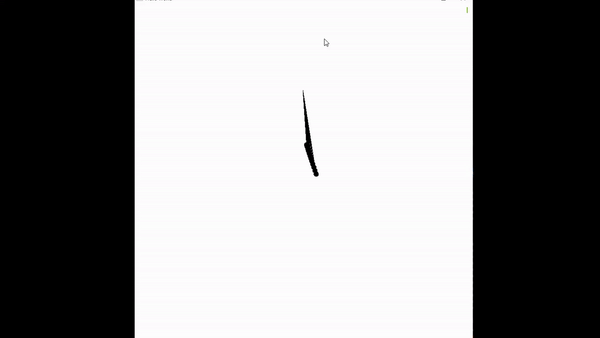

# Simple Pendulum simulation using OpenGL and C++

[Video Demo](https://youtu.be/mW9hMDeniRc)

A simple pendulum consists of a rod and a mass. The mass is connected to the rod which swings freely about its pivot.

the equation of motion for a simple pendulum is:
ɑ = -(g/r)sin(θ)

where ɑ is the angular acceleration
g is the gravitational constant
L is the length
and θ is the angle measured from the resting position of the pendulum

## this simulation makes use of semi-implicit Euler
Semi-implicit Euler is a [Numerical Integration](https://en.wikipedia.org/wiki/Numerical_integration) method used to approximate the solution of the pendulum's equation of motion.

Advantages
* Simple to implement compared to methods such as Runge-Kutta order 4
* More stable than explicit Euler since it does not add energy to the system
  * For example in a spring-damper system explicit Euler will add energy to the system causing the simulation to become unstable
  
  * Meanwhile, semi-implicit Euler does not add energy to the system, therefore, producing an accurate simulation
  

Disadvantages
* Not as accurate as other methods such as implicit Euler. It is first-order accurate. (same as explicit Euler)

**However** for our purposes, semi-implicit Euler is sufficiently accurate.
[Reference](https://gafferongames.com/post/integration_basics/)

## The time step of the simulation is not linked to frame rate
The time step used in physics calculations will affect the simulation's behaviour and accuracy.

* The ideal situation is to use a fixed time step in physics calculation. This time step is used each time a frame is rendered.
  * However since frame rate is variable, it results in the simulation running at different speeds when the frame rate is higher/lower than the time step.
* Another possible method is to use variable time steps based on the time taken between each frame.
  * This solves the issue of the simulation speeding up/slowing down however, it presents another issue.
  * By having variable time steps, the physics will behave differently based on the current frame rate.
  * In extreme cases of lag, it might even cause the simulation to misbehave as the time step is too large.

These two methods are flawed and can be easily solved by unlinking the physics time step from the frame rate.
* This can be done by using fixed time steps and a time accumulation variable.
* For each frame, add the time taken to the accumulation variable.
* When the time within the accumulation variable exceeds the physics time step, simulate the physics of the object.
This separates the frame rate from the physics time step by not simulating the object's motion each frame but rather when the time elapsed is greater than the time step.
This results in an accurate and deterministic simulation(When the input is the same the output will be the same).
[Reference](https://gafferongames.com/post/fix_your_timestep/)